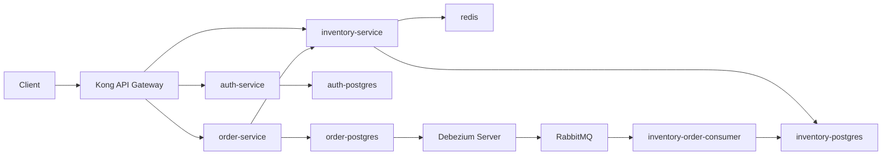
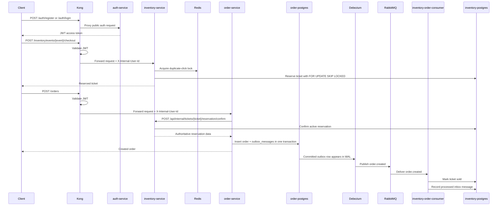
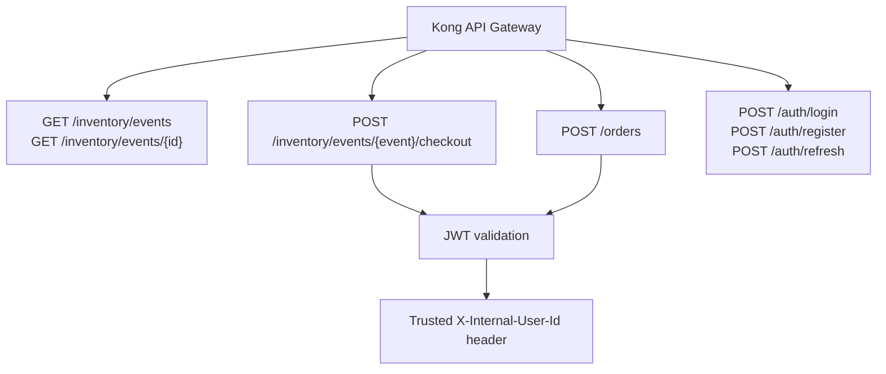

# Flash Sale Backend

Laravel microservices demo for a flash-sale ticketing system under extreme write contention.

The core scenario is simple: many users try to reserve a small number of tickets at the same moment. The project is built to demonstrate production-style backend architecture decisions around contention control, identity propagation, and reliable event delivery.

## What This Demo Proves

- no ticket oversell through row-level locking with `FOR UPDATE SKIP LOCKED`
- no direct DB-write-then-publish race through Transactional Outbox
- WAL-based event delivery with Debezium instead of polling
- idempotent event consumption on the inventory side
- public read / protected write API split behind Kong
- Docker-first local setup with a full runnable stack

## Architecture At A Glance

High-level topology:



Reserve-to-sold sequence:



Public read / protected write split:



## Services

| Service | Responsibility | Storage |
| --- | --- | --- |
| `auth-service` | registration, login, refresh token flow, JWT issuance | `auth-postgres` |
| `inventory-service` | public event reads, ticket reservation, internal reservation confirmation | `inventory-postgres`, `redis` |
| `order-service` | order creation and outbox writes | `order-postgres` |
| `inventory-order-consumer` | consumes `order.created` and finalizes reserved tickets as sold | `inventory-postgres`, `rabbitmq` |
| `kong` | local API gateway, JWT validation, trusted header propagation | none |
| `debezium` | reads PostgreSQL WAL and pushes outbox events to RabbitMQ | offset/schema history files |

## Key Flows

### Public Read

- `GET /inventory/events`
- `GET /inventory/events/{id}`

These routes are public through Kong.

### Reservation

1. Client authenticates through `auth-service`.
2. Client calls `POST /inventory/events/{event}/checkout` through Kong.
3. Kong validates JWT and forwards trusted `X-Internal-User-Id`.
4. Inventory acquires a Redis-backed duplicate-click lock.
5. Inventory reserves the first available ticket using `FOR UPDATE SKIP LOCKED`.

### Order Creation And Event Delivery

1. Client calls `POST /orders` through Kong.
2. `order-service` confirms the reservation through inventory internal API.
3. `order-service` writes `orders` and `outbox_messages` in one transaction.
4. Debezium reads the committed outbox row from PostgreSQL WAL.
5. Debezium publishes `order.created` to RabbitMQ.
6. `inventory-order-consumer` consumes the event and marks the ticket as `sold`.
7. Inventory records the processed event in `inbox_messages` for idempotency.

## Local Development

This repository is Docker-first. The services talk to each other only over the Docker network.

Host-exposed endpoints:

- `http://127.0.0.1:8080` — Kong proxy
- `http://127.0.0.1:8004` — Kong admin
- `http://127.0.0.1:15672` — RabbitMQ management UI

Everything else stays internal to Docker Compose.

### Quick Start

```bash
make up
make smoke
make smoke-debezium
make loadtest
```

Useful commands:

```bash
make ps
make logs
make loadtest
make queue-depth
make debezium-logs
make consumer-logs
make down
```

## CI

GitHub Actions pipeline lives in [`/Users/yevhenii/PhpstormProjects/flash-sale-backend/.github/workflows/ci.yaml`](/Users/yevhenii/PhpstormProjects/flash-sale-backend/.github/workflows/ci.yaml#L1).

Current CI stages:

- `App Tests` — runs `auth-service`, `inventory-service`, and `order-service` test suites
- `Integration Smoke` — starts the full stack and runs `make smoke` plus `make smoke-debezium`

The repeatable `k6` load proof currently stays as a local/manual demo command, not a default CI gate.

## Demo Script

Minimal local demo:

1. Start the stack with `make up`.
2. Run `make smoke` to verify the gateway contract:
   public auth route, public inventory read route, protected write routes.
3. Run `make smoke-debezium` to verify the full booking lifecycle:
   register -> reserve -> order -> outbox -> Debezium -> RabbitMQ -> inventory sold.
4. Run `make loadtest` to prove that concurrent reservation pressure does not oversell tickets.

### Load Test Proof

`make loadtest` runs a repeatable reservation contention scenario with `k6`:

- seeds a fresh event with a configurable number of tickets
- registers one authenticated user per test iteration
- sends concurrent checkout requests through Kong
- validates that final `reserved + sold` never exceeds the event ticket count

Example observed local result:

- `50` tickets
- `200` checkout attempts
- `100` virtual users
- `50` successful reservations
- `150` sold-out responses
- `0` oversell
- total test time around `3.6s`

Useful overrides:

```bash
LOADTEST_TICKETS=50 LOADTEST_ITERATIONS=250 LOADTEST_VUS=100 LOADTEST_SETUP_TIMEOUT=5m make loadtest
```

## Example Message Contract

Current documented integration event:

- [`/Users/yevhenii/PhpstormProjects/flash-sale-backend/docs/message-contracts/order.created.json`](/Users/yevhenii/PhpstormProjects/flash-sale-backend/docs/message-contracts/order.created.json)

## Project Conventions

- business logic in Actions
- infrastructure/external integrations in Services
- validation in Form Requests
- serialization in API Resources
- unit-first testing for core logic, then feature tests for request flow

## Additional Context

- architecture notes: [`/Users/yevhenii/PhpstormProjects/flash-sale-backend/ARCHITECTURE_CONTEXT.md`](/Users/yevhenii/PhpstormProjects/flash-sale-backend/ARCHITECTURE_CONTEXT.md)
- ADR index: [`/Users/yevhenii/PhpstormProjects/flash-sale-backend/docs/adr/README.md`](/Users/yevhenii/PhpstormProjects/flash-sale-backend/docs/adr/README.md)
- scripts reference: [`/Users/yevhenii/PhpstormProjects/flash-sale-backend/scripts/README.md`](/Users/yevhenii/PhpstormProjects/flash-sale-backend/scripts/README.md)

## Current Scope

Implemented well enough for a strong backend architecture demo:

- authentication and gateway-trusted identity
- public read API for events
- high-contention reservation path
- repeatable k6-based reservation contention proof
- order creation with transactional outbox
- Debezium-based event delivery
- RabbitMQ consumer with inbox/idempotency handling

Still intentionally out of scope for now:

- payment integration
- Kubernetes deployment manifests in this repository
- frontend
- broader analytics/read models
